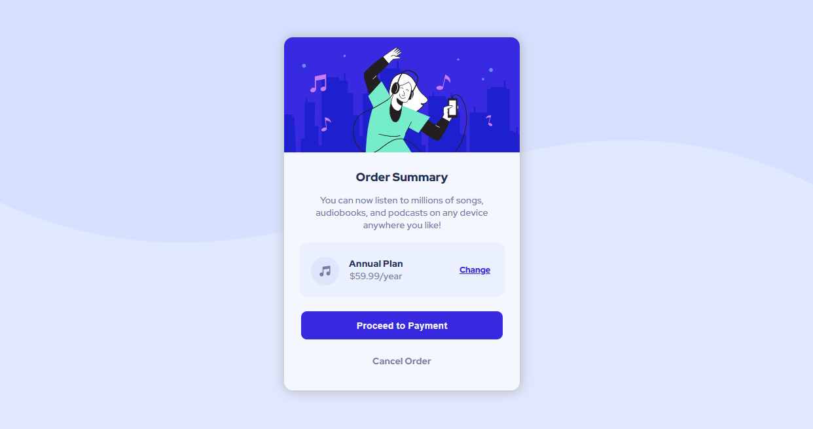

# Challenge solution to Frontend Mentor - Order summary card

This is a solution to the [Order summary card challenge on Frontend Mentor](https://www.frontendmentor.io/challenges/order-summary-component-QlPmajDUj).

## Table of contents

- [Overview](#overview)
  - [The challenge](#the-challenge)
  - [Screenshot](#screenshot)
  - [Links](#links)
- [My process](#my-process)
  - [Built with](#built-with)
  - [What I learned](#what-i-learned)
  - [Continued development](#continued-development)
  - [Useful resources](#useful-resources)
- [Author](#author)


## Overview

### The challenge

- See hover states for interactive elements;
- To apply responsive design with small details.

### Screenshot




### Links

- Solution URL: [GitHub - Jonathan](https://your-solution-url.com)
- Live Site URL: [Live site](https://your-live-site-url.com)

## My process

### Built with

- Semantic HTML5 markup
- CSS custom properties
- Flexbox
- Mobile workflow


### What I learned

- Pseudo-class

```css
.container .card-box .card-price .info-card::before {
    content: "";
    background: url(../images/icon-music.svg) no-repeat center;
    width: 48px;
    height: 48px;
    position: absolute;
    left: 0;
    margin-left: 20px;
}
```

- Media Query
```css
@media (max-width: 400px) {
    
    .container {
        background: var(--box-price) url(../images/pattern-background-mobile.svg) no-repeat center;
        background-position: top;
        background-size: 100%;
    }
```

### Continued development

I can training more about _flex_ property with this challenge.
- Next step is JavaScripts!

### Useful resources

- [Flexbox](https://www.w3schools.com/css/css3_flexbox_container.asp) - I knew that property was essencial. Now I learn more about this, it's really useful.
- [pseudo-class](https://www.w3schools.com/css/css_pseudo_classes.asp) - To read e learn more on this . I recommend it to anyone who is still learning this concept. Helped me a lot.


## Author

- Instagram - [@jonathan_samael_](https://www.instagram.com/jonathan_samael_/)
- Frontend Mentor - [@JonathanSamael](https://www.frontendmentor.io/profile/JonathanSamael)
- LinkedIn - [@jonathan-amaral](https://www.linkedin.com/in/jonathan-amaral/)

